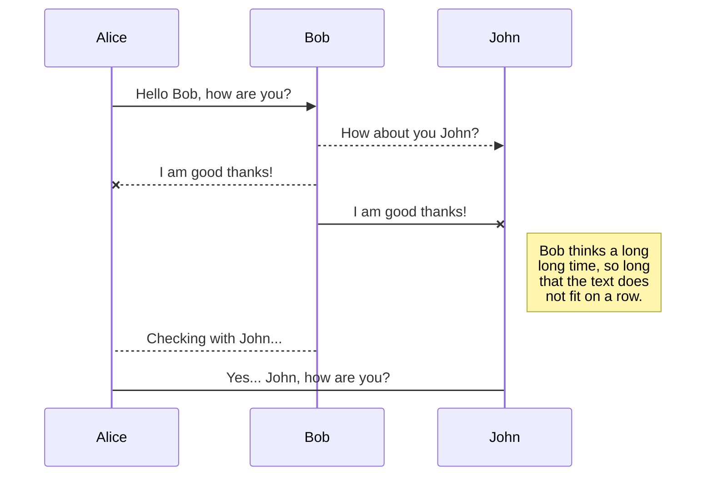
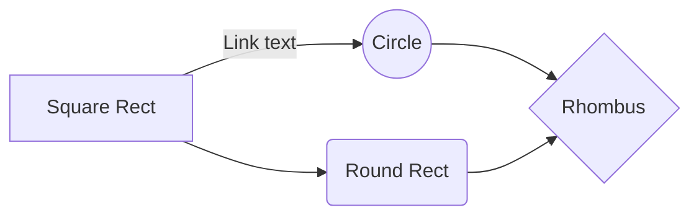

# Welcome to Readme JJ! 

En este archivo realizaré varios  **TEST**.  Para ver si puedo dar una vista más atractiva.

# Subire un archivo  que le aplicare  cambios

La intención es poder practicar con los branch merge, conflict pus, pull checkout **Espero que quedé Genial**

## Solo son linea referenciales 

Intentando mejorar el  **Estilo** para el curso **The Github** 

Podrá ver los detalles de la promoción en el e siguiente link **Pagina Web**, **Landing Page**, **Github**, **YouTube**, **Instagram**. Usa [Linux Devops](https://geekmonkeytech.com/), No olvides _**reservar**_

> **Note:** Es **Por poco tiempo** Es el momento YA!

## Tabla de beneficios

Detallaremos los beneficios en la siguiente tabla:

|                |Preventa                         |Venta                         |
|----------------|-------------------------------|-----------------------------|
|Cursos online|`'En vivo'`            |'Clases diferidas'            |
|100% Practico          |`"certificacion"`            |"Global"           

## Centrado

$$
Examen de certificación
$$
> Toma nota**Super Genial* Registarte [here](https://geekmonkeytech.com).
 

## UML diagrams

You can render UML diagrams using [Mermaid](https://mermaidjs.github.io/). For example, this will produce a sequence diagram:

And this will produce a flow chart:

